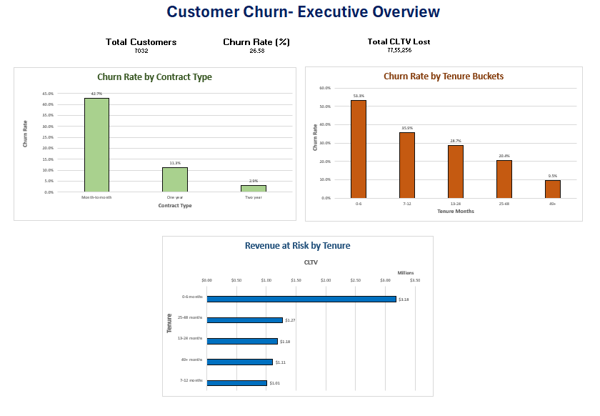
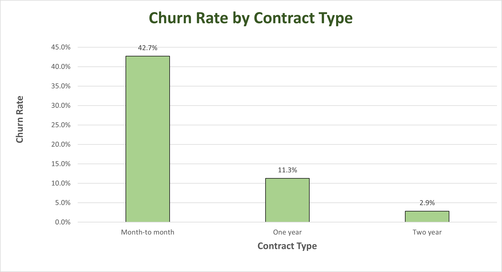
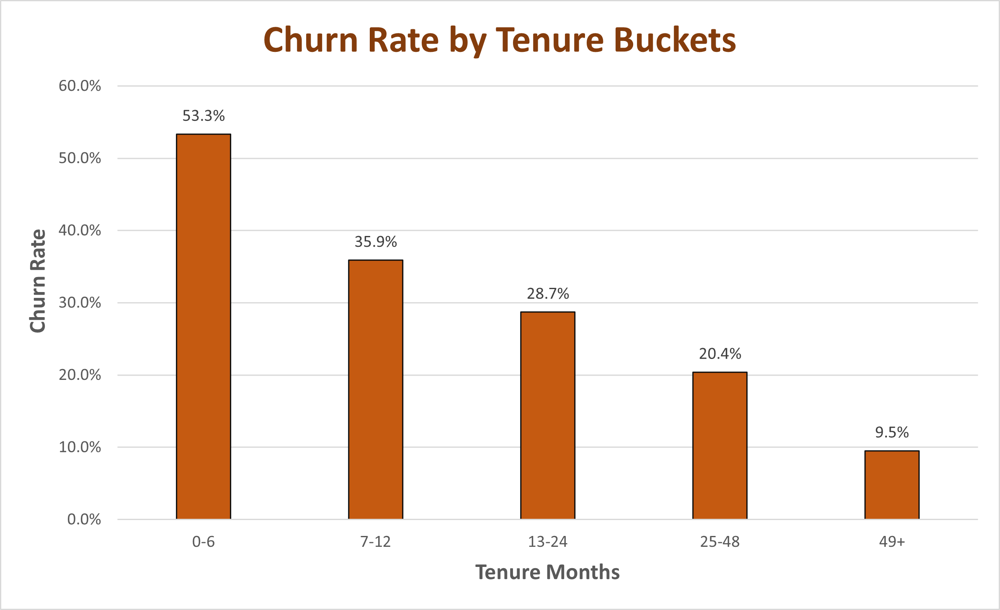
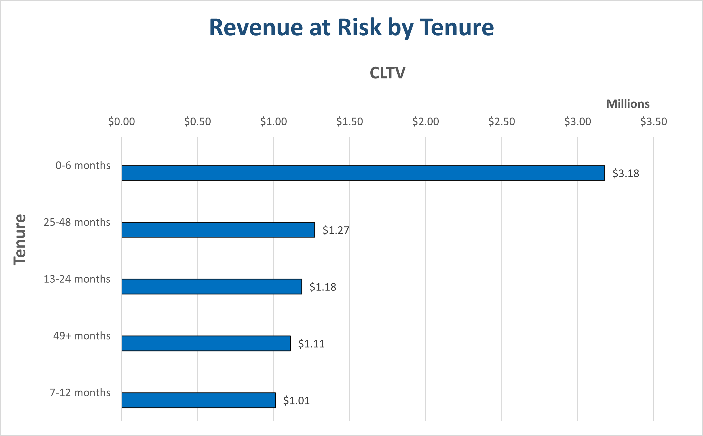

# Customer Churn & Revenue at Risk Analysis

## Overview
- Analyzed telecom customer churn to identify churn drivers and quantify financial impact
- Used **SQL (MySQL)** for analysis and **Microsoft Excel** to build an executive-level dashboard
- Focused on both **churn rates** and **revenue at risk** using Customer Lifetime Value (CLTV)

## Dataset
- IBM Telco Customer Churn dataset (Kaggle)
- Includes customer tenure, contract type, churn status, and estimated CLTV

## Objectives
- Measure overall customer churn
- Analyze churn patterns by **contract type** and **customer tenure**
- Quantify **revenue at risk** by summing CLTV of churned customers
- Identify high-impact customer segments for retention

## Analysis & Tools
- **SQL (MySQL)**
  - CTEs
  - CASE statements
  - Aggregations (COUNT, SUM, AVG)
    
- **Microsoft Excel**
  - KPI tracking
  - Executive dashboard
  - Data visualization
    
## Dashboard Preview

## Churn Analysis
### Churn by Contract Type

### Churn by Tenure

## Revenue at Risk

## Key Insights
- Month-to-month customers experience the highest churn rate compared to longer contract types.
- Customer churn is most pronounced within the first 6 months of tenure, highlighting early lifecycle risk.
- Revenue-at-risk analysis shows that early-tenure churn accounts for the largest CLTV loss.
- Longer contract durations are associated with lower churn rates and reduced revenue loss.

## Repository Contents
- `churn_analysis.sql` – SQL queries used for analysis
- `churn_dashboard.xlsx` – Excel dashboard
- `images/` – Dashboard and chart screenshots
